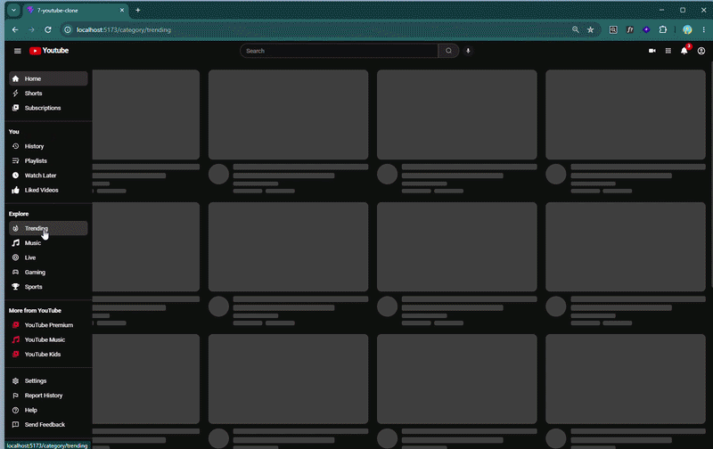

## 🎬 YouTube Clone

A responsive YouTube clone built with React and Tailwind CSS, using the YouTube Data API (via RapidAPI) to fetch real video content, channel info, and search results.

This project was built as part of a frontend development course to practice component architecture, client-side routing, API integration, and modern React patterns.

## Features

 Home feed with trending/category-based videos
 
 Search functionality with search results page
 
 Video detail page with related videos
 
 Category sidebar with channel navigation
 
 Fully responsive design (mobile, tablet, desktop)
 
 Fast client-side navigation with React Router

##  Built With

React – component-based UI

Tailwind CSS – utility-first styling

React Router – client-side routing (BrowserRouter, Routes, Route, Link, NavLink, useParams, useSearchParams, useNavigate, useLocation)

RapidAPI (YouTube Data API) – fetching video, channel, and search data

Vite – build tool and dev server

## What I Learned

Structuring a multi-component React app (Header, Sidebar, Feed)

Managing state with useState, useEffect, useContext, and useRef

Sharing data across components with Context API and prop drilling

Fetching and displaying real API data

Debugging routing, JSX structure issues, and dev server/port conflicts

Styling a fully responsive layout with Tailwind CSS

## 📸 Preview

